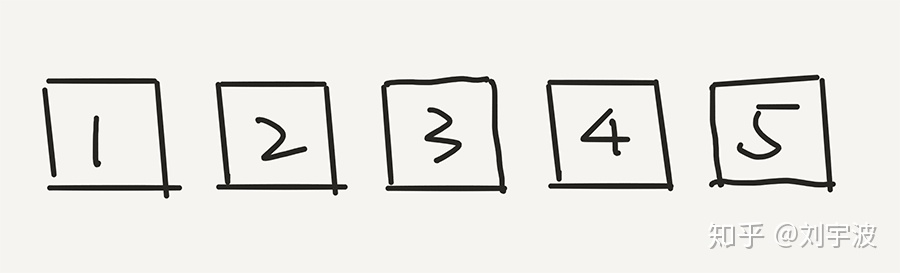
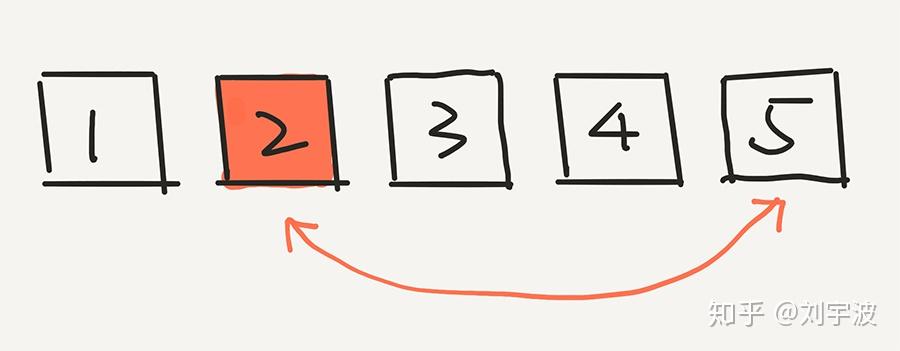
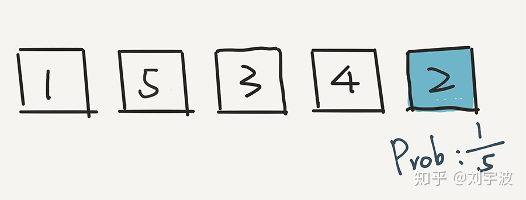
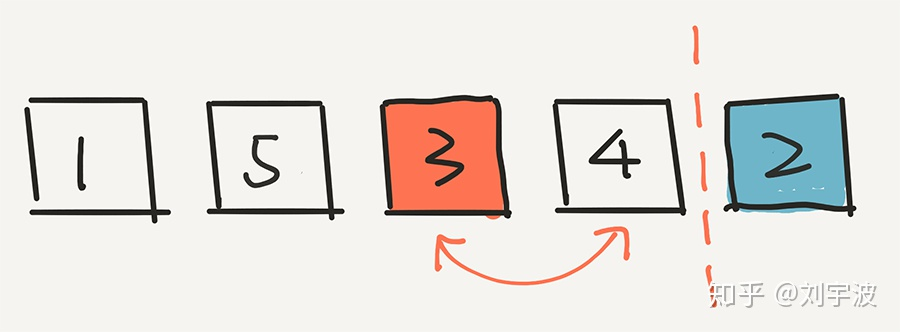
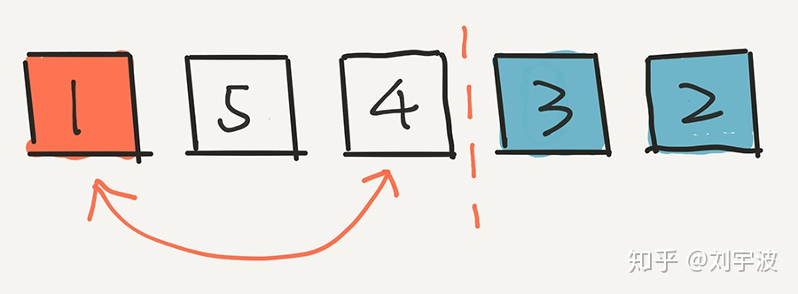
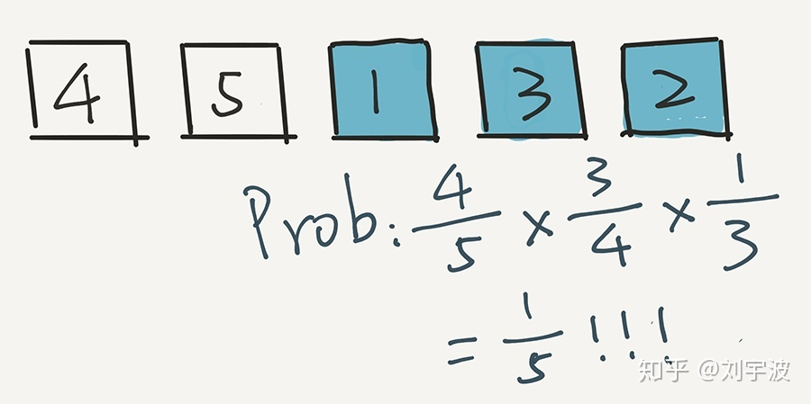
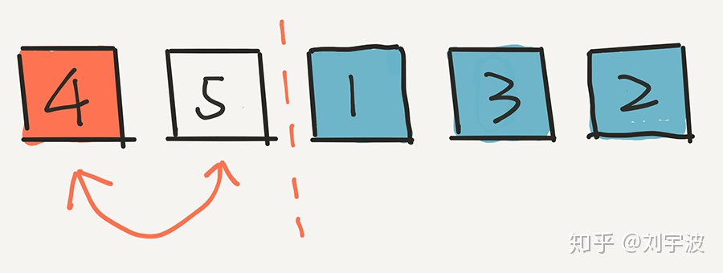
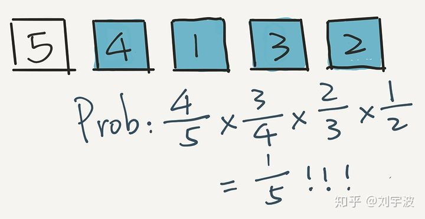
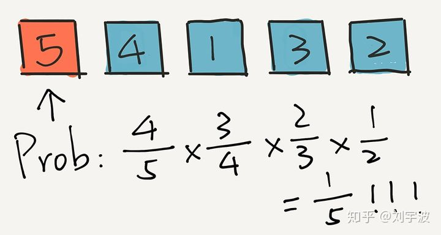

经典洗牌算法Knuth-Durstenfeld Shuffle

```c#
public static void Knuth(IList<int> arr)
{
    Random r = new Random();
    for (var i = arr.Count - 1; i >= 0; i--)
    {
        var temp = arr[i];
        var index = r.Next(0, i + 1);
        arr[i] = arr[index];
        arr[index] = temp;
        Thread.Sleep(50);
    }
}
```

这是一个公平的洗牌算法，公平的定义为：一个长度为N的排列，洗牌后最终可能出现的结果也是N个。

也就是说，对于生成的排列，每一个元素出现在每一个位置的概率是相同的。

抽象看来，洗牌算法的本质就是把所有元素放进一个口袋，然后每次不放回随机取出一个元素，生成排列。

需要注意的是，随机函数也会影响洗牌函数的公平性。

验证一下这个算法的正确性，采用知乎大佬的回答

作者：刘宇波
链接：https://www.zhihu.com/question/26934313/answer/743798587
来源：知乎
著作权归作者所有。商业转载请联系作者获得授权，非商业转载请注明出处。


在这里，我们模拟一下算法的执行过程，同时，对于每一步，计算一下概率值。

我们简单的只是用 5 个数字进行模拟。假设初始的时候，是按照 1，2，3，4，5 进行排列的。




那么，根据这个算法，首先会在这五个元素中选一个元素，和最后一个元素 5 交换位置。假设随机出了 2。




下面，我们计算 2 出现在最后一个位置的概率是多少？非常简单，因为是从 5 个元素中选的嘛，就是 1/5。实际上，根据这一步，任意一个元素出现在最后一个位置的概率，都是 1/5。




下面，根据这个算法，我们就已经不用管 2 了，而是在前面 4 个元素中，随机一个元素，放在倒数第二的位置。假设我们随机的是 3。3 和现在倒数第二个位置的元素 4 交换位置。




下面的计算非常重要。3 出现在这个位置的概率是多少？计算方式是这样的：


其实很简单，因为 3 逃出了第一轮的筛选，概率是 4/5，但是 3 没有逃过这一轮的选择。在这一轮，一共有4个元素，所以 3 被选中的概率是 1/4。因此，最终，3 出现在这个倒数第二的位置，概率是 4/5 * 1/4 = 1/5。

还是 1/5 !

实际上，用这个方法计算，任意一个元素出现在这个倒数第二位置的概率，都是 1/5。


相信聪明的同学已经了解了。我们再进行下一步，在剩下的三个元素中随机一个元素，放在中间的位置。假设我们随机的是 1。




关键是：1 出现在这个位置的概率是多少？计算方式是这样的：




即 1 首先在第一轮没被选中，概率是 4/5，在第二轮又没被选中，概率是 3/4 ，但是在第三轮被选中了，概率是 1/3。乘在一起，4/5 * 3/4 * 1/3 = 1/5。

用这个方法计算，任意一个元素出现在中间位置的概率，都是 1/5。


这个过程继续，现在，我们只剩下两个元素了，在剩下的两个元素中，随机选一个，比如是4。将4放到第二个位置。




然后，4 出现在这个位置的概率是多少？4 首先在第一轮没被选中，概率是 4/5；在第二轮又没被选中，概率是 3/4；第三轮还没选中，概率是 2/3，但是在第四轮被选中了，概率是 1/2。乘在一起，4/5 * 3/4 * 2/3 * 1/2 = 1/5。

用这个方法计算，任意一个元素出现在第二个位置的概率，都是 1/5。




最后，就剩下元素5了。它只能在第一个位置呆着了。

那么 5 留在第一个位置的概率是多少？即在前 4 轮，5 都没有选中的概率是多少？

在第一轮没被选中，概率是 4/5；在第二轮又没被选中，概率是 3/4；第三轮还没选中，概率是 2/3，在第四轮依然没有被选中，概率是 1/2。乘在一起，4/5 * 3/4 * 2/3 * 1/2 = 1/5。



算法结束。


你看，在整个过程中，每一个元素出现在每一个位置的概率，都是 1/5 ！

所以，这个算法是公平的。

当然了，上面只是举例子。这个证明可以很容易地拓展到数组元素个数为 n 的任意数组。整个算法的复杂度是 O(n) 的。