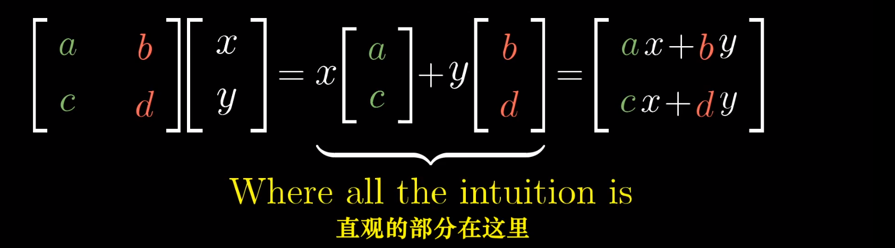

矩阵代表着向量空间的一个基,一般矩阵一列代表这一个方向的基向量

相乘的意义在于一个向量变化到一个新的基中的位置

用向量分别乘以矩阵每一列的各个数(矩阵*向量是矩阵需要放在左边,矩阵乘法不满足交换律)

以2x2矩阵为例,
$$
\begin{bmatrix}
3 & 2 \\
-2 & 1\\ 
\end{bmatrix}*
\overrightarrow{xy}=
x
\begin{bmatrix}
3  \\ 
-2 \\
\end{bmatrix}+
y
\begin{bmatrix}
2 \\ 
1 \\ 
\end{bmatrix}=
\begin{bmatrix}
3x+2y \\ 
-2x+1y\\ 
\end{bmatrix}
$$

