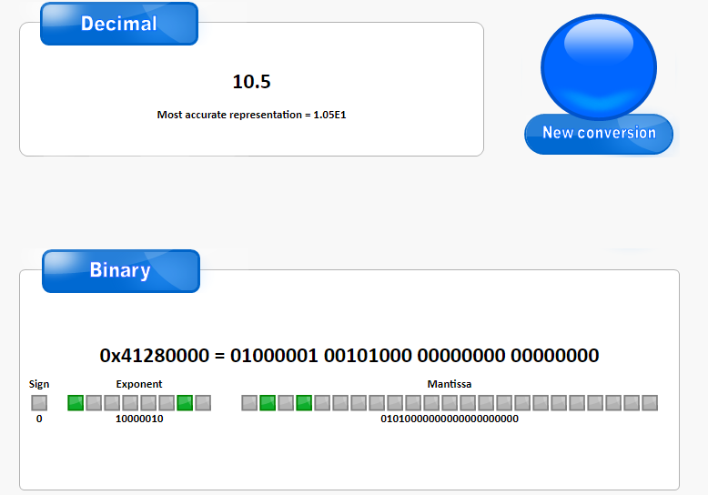

[IEEE754浮点数WIKI](https://en.wikipedia.org/wiki/IEEE_754-1985)

一个32位浮点数在内存中的组成

sign第一位，符号位，正数为0，负数为1

exponent （8bits）指数位，图中的绿色区域

fraction 尾数位，图中红色的区域

指数的意思是从十进制转换为二进制科学计数法时以2为底的底数，IEEE754规定，8位二进制指数表示[-127,128]范围内。（32位单精度类型中，偏移量位127，64位双精度中偏移量是1023）。偏移量的用处是保证指数始终始终是一个非负整数。

尾数用来存储小数部分二进制。

浮点数的精度问题，是因为十进制小数转为二进制计算时小数部分乘2取整，只有满足小数部分x/5^=0的才可以转为有限不循环的二进制，但是计算机是无法储存无限的二进制的，多出的小数二进制部分必须舍去。

通俗来说，有限的二进制只能表示小数末尾为5的十进制小数，其他的小数只能用无限循环的二进制来表示，计算机存储一个数值的位数是有限的，多的位数只能舍去，这里就发生了一次精度问题。

抛开数学概念，十进制中1的一半是0.5，二进制中1的一半是0.1；十进制中自然可以十等分形成小数，所有不能十等分的都是无限循环，同理二进制中只能二等分，所有不能二等分的自然都是无限循环。正如切蛋糕，二进制就像一把一次只能切一半的刀。

十进制小数转换23位单精度浮点数的过程：

以10.5为例，整数部分的二进制为1010 ，小数部分为.1  即为1010.1

把小数点移动到整数位左数第一位之后，1.0101（作为尾数） 移动了3位，作为偏移前的指数，需要加上精度类型的偏移量3+127=130 = 1000010 作为偏移后的指数。

转换为二进制时，最高位总是为1，所以可以省去，得到 0101，23-4=19 剩余19位补满0。

| 0      | 10000010 | 01010000000000000000000 |
| ------ | -------- | ----------------------- |
| 符号位 | 指数位   | 尾数位                  |

通过[工具验证一下](http://www.binaryconvert.com/result_float.html?decimal=049048046053) 正确。

关于浮点数的精度问题，参考这位大佬的文章 [IEEE754标准: 三, 为什么说32位浮点数的精度是"7位有效数" - 李平笙的文章 - 知乎](https://zhuanlan.zhihu.com/p/343040291)

自己总结一下：计算机中的小数是离散运算的，也就是说，你的小数会始终指向一个离散的近似值，这个值的间隔就等于浮点数的精度。当浮点数的数值越大的时候，精度差距就越大，具体的间隔参考下表。

| 原始指数 | 偏移后指数 |    最小值    |      最大值      |     间隔     |
| :------: | :--------: | :----------: | :--------------: | :----------: |
|    −1    |    126     |     0.5      | ≈ 0.999999940395 | ≈ 5.96046e-8 |
|    0     |    127     |      1       | ≈ 1.999999880791 | ≈ 1.19209e-7 |
|    1     |    128     |      2       | ≈ 3.999999761581 | ≈ 2.38419e-7 |
|    2     |    129     |      4       | ≈ 7.999999523163 | ≈ 4.76837e-7 |
|    10    |    137     |     1024     | ≈ 2047.999877930 | ≈ 1.22070e-4 |
|    11    |    138     |     2048     | ≈ 4095.999755859 | ≈ 2.44141e-4 |
|    23    |    150     |   8388608    |     16777215     |      1       |
|    24    |    151     |   16777216   |     33554430     |      2       |
|   127    |    254     | ≈ 1.70141e38 |   ≈ 3.40282e38   | ≈ 2.02824e31 |

